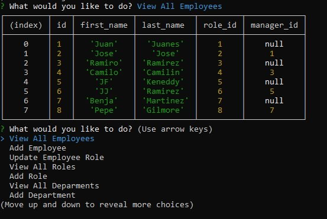

# Employee Tracker 

## Description
    
Handle a database with three tables, ```department```, ```'role``` and ```employee```. Allows to view, create and update new rows to the tables, via console prompt. The packages used in this code are ```inquirer```, ```mysql2``` and ```dotenv```. 



## Table of content
* [Description](#description)
* [Instalation](#installation)
* [Usage Information](#usage-information)


## Installation

To run this project, install it locally using npm:
```
npm i
```

## Usage Information
    
run ```node index.js``` to run the file.

## Questions
    
[Juan Jose Ramirez Github profile](https://github.com/JuanjoRamirez262)

email: juanjoramirezps@gmail.com

